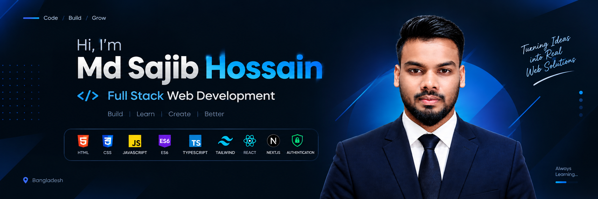

<h1 align="center">Hi, I'm Md Sajib Hossain 👋</h1>

<h3 align="center">Full Stack Web Development</h3>

  Building modern, responsive and user-friendly web experiences.

---

## 👨‍💻 About Me

I'm a passionate **Full Stack Web Developer** who enjoys turning ideas into real web applications.

I've built projects using **HTML, CSS, JavaScript, ES6+, TypeScript, Tailwind CSS, React, Next.js, and Authentication**. I continue to improve my skills by building practical projects and exploring modern web technologies.

I enjoy solving problems, creating responsive interfaces, and writing clean and maintainable code.

---

## 🛠️ Skills & Technologies

### 🌐 Frontend

* HTML5
* CSS3
* JavaScript
* ES6+
* TypeScript
* Tailwind CSS
* React
* Next.js

### 🔐 Development & Other Skills

* Authentication
* API Integration
* Responsive Web Design
* Git & GitHub
* Modern UI Development

---

## 🌟 Featured Projects

### 💪 FitLog — Workout Library

A modern workout library and workout planning application built with **Next.js and React**.

**Highlights:**

* Workout library with API integration
* Workout details page
* Today's Plan functionality
* Save workout functionality
* Responsive design
* Toast notifications
* Modern dark UI

🔗 [View Repository](../fit-log-assignment-06)

---

### 🌐 Web Developer Portfolio

A responsive personal portfolio website created to showcase web development skills, projects, and personal information.

**Highlights:**

* Responsive layout
* Clean and modern UI
* HTML & CSS implementation
* Portfolio sections
* Mobile-friendly design

🔗 [View Repository](../web-developer-portfolio)

---

### 💻 My Simple Website

A beginner-friendly responsive website built while developing strong fundamentals in HTML and CSS.

**Highlights:**

* Semantic HTML structure
* CSS styling
* Responsive layout
* Clean page structure

🔗 [View Repository](../my-simple-website)

---

### 🎨 Conceptual HTML CSS

A frontend practice project focused on improving HTML and CSS concepts through hands-on implementation.

**Highlights:**

* HTML structure
* CSS styling
* Layout practice
* Responsive design concepts
* Practical frontend development

🔗 [View Repository](../conceptual-html-css)

---

## 📚 Development Journey

My development journey started with the fundamentals of web development and gradually expanded into modern frontend technologies.

**HTML → CSS → JavaScript → ES6 → TypeScript → Tailwind CSS → React → Next.js → Authentication**

Each project has helped me understand how real-world web applications are designed, developed, and improved.

---

## 🎯 What I Focus On

* Building responsive web applications
* Creating clean and reusable UI
* Working with modern JavaScript
* Developing React & Next.js applications
* Integrating APIs
* Implementing authentication
* Improving code quality
* Learning through real-world projects

---

## 📈 GitHub Journey

I use GitHub to build projects, practice development, track my progress, and share what I create.

I'm continuously working on improving my development skills and building better projects.

---

## 🚀 My Goal

To grow as a **Full Stack Web Developer** by building real-world applications, learning modern technologies, and continuously improving my problem-solving and development skills.

---

## 📫 Connect With Me

I'm always interested in learning, building, and connecting with fellow developers.

**Md Sajib Hossain**
**Full Stack Web Development**

---

### ⚡ Build • Learn • Create • Improve

